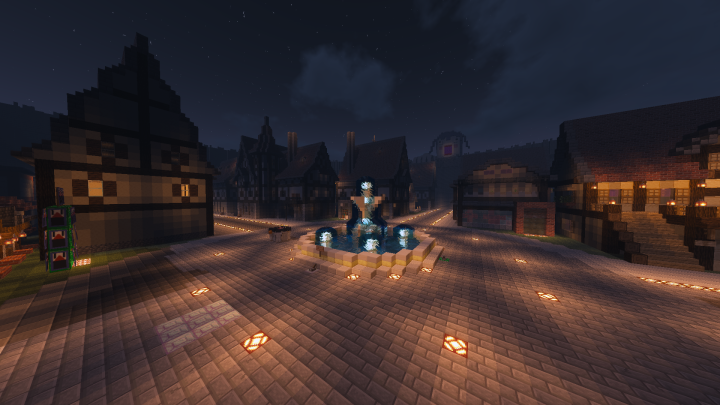
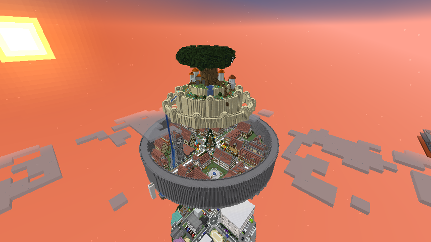

!!!Warning

！！注意！！このWikiはまだ製作中です。その点に留意してご覧ください。

# HUBとは？

HUBとは主に私たち**米粒**もしくは**オープン参加者**が

Kome-labが運営するマインクラフトサーバーに**簡単に接続するため**のものである。

分からない人のために言うとフォルダが*マインクラフトサーバー*だとして

HUBはWindowsの*クイックアクセス*のようなものである。

# Studio-Kometubu HUBの様子

私たちの持つHUBサーバーは様々な建築物で溢れている。

Studio-Kometubuが発足してすぐに建てられたものやそれ以降に建てられたものなどが混在している。

### ※注意　現在の写真とは異なる場合があります

